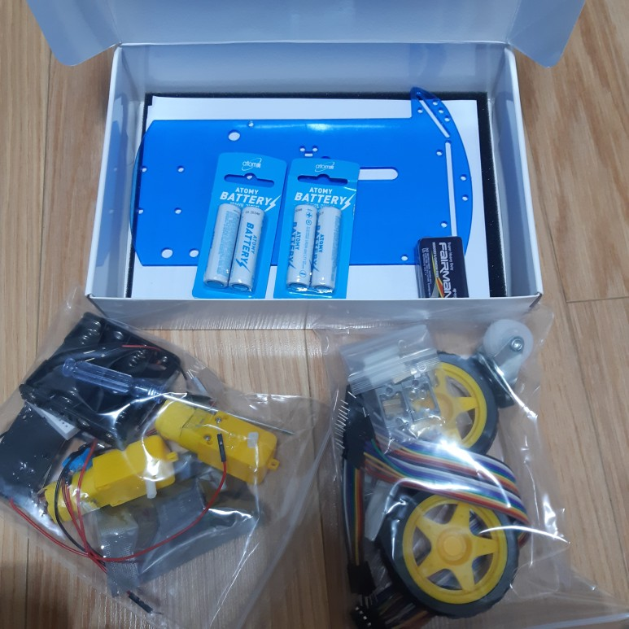
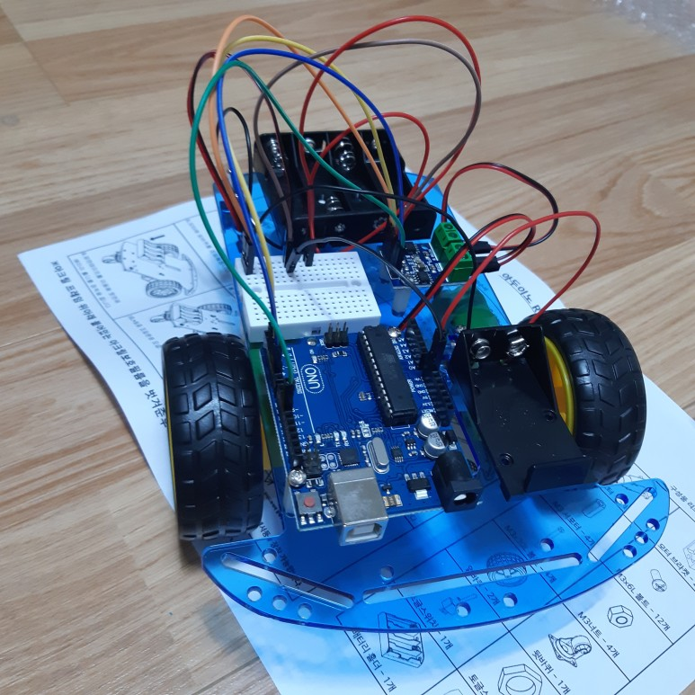
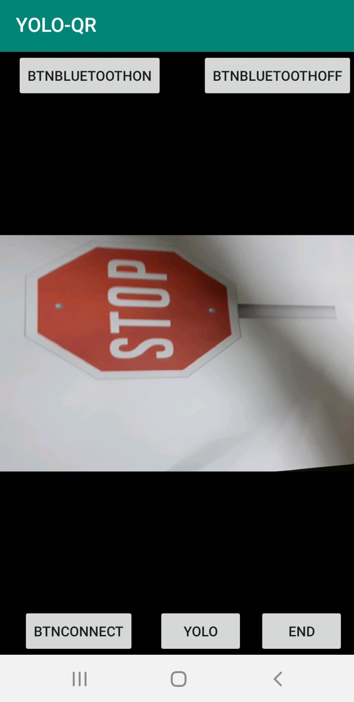
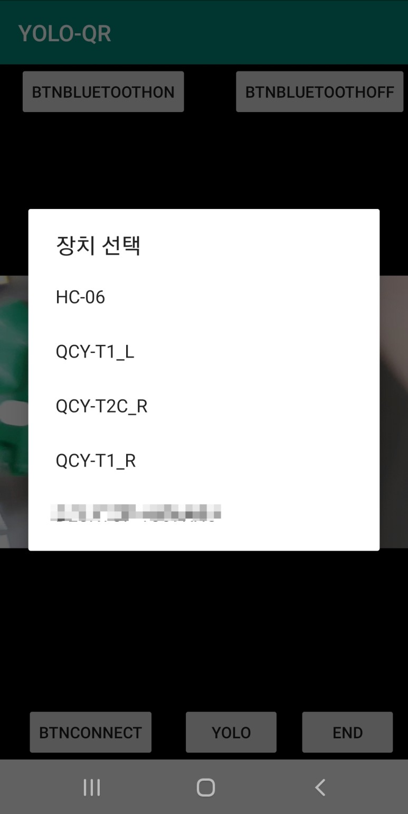
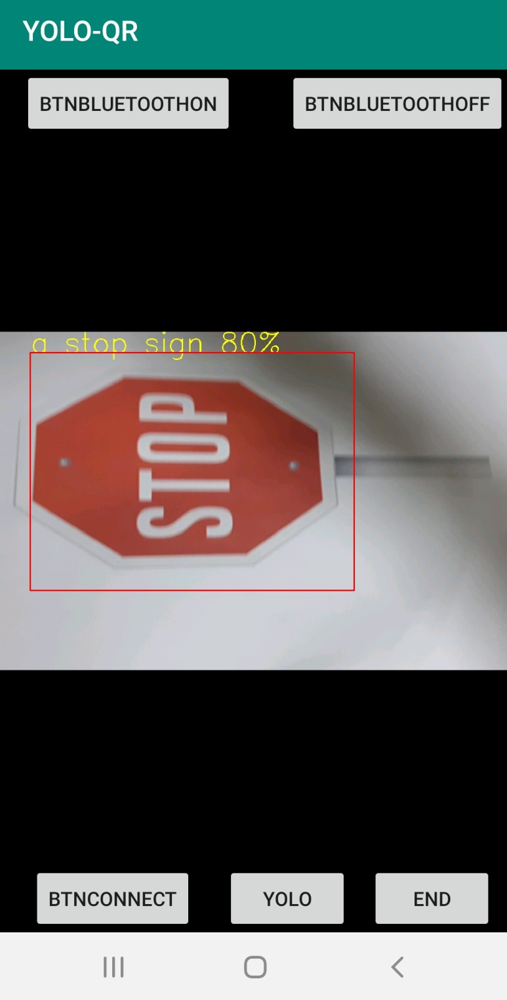

# YOLO-RC-car  
This Program Using YOLOv3-tiny for object detection with arduino RC car  
# Arduino car  
- 설치  
  
   
-구매처  
https://smartstore.naver.com/domekit/products/593234585  
  
# Android App  
  
When turn on the application  
  
If you already bluetooth on, than you press connect button  
  
Program detection object and trans information to arduino RC car

Reference:  
https://pjreddie.com/darknet/yolo/  
https://github.com/pjreddie/darknet/blob/master/cfg/yolov3.cfg  
https://github.com/AlexeyAB/darknet  
처음봐? 아두이노 - 유초희 저  
Do it Android -8th  
https://bugwhale.tistory.com/entry/android-bluetooth-application  
